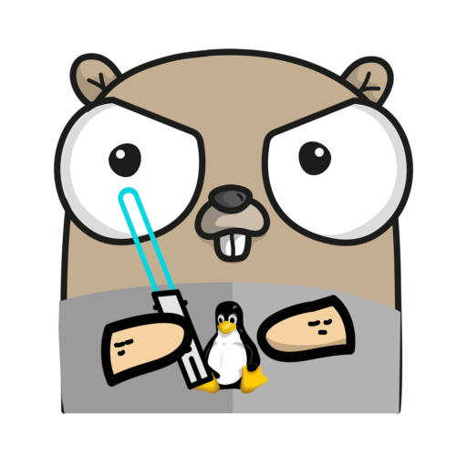

## Ona SRE Tooling

[](https://github.com/onaio/sre-tooling/actions?query=workflow%3ACI) [](https://coveralls.io/github/onaio/sre-tooling?branch=master)

A set of useful SRE tools. This project is written Golang (v1.13 and above).



### Building sre-tooling

Before you install sre-tooling, make sure your environment is setup and ready for Golang packages. Install the Golang compiler using your package manager. On Ubuntu, run:

```sh
sudo apt install golang
```

If you haven't already, set the `GOPATH` environment variable (preferably in any of your local shell environment files e.g ~/.bashrc):

```sh
export GOPATH=$HOME/go
```

Enable Go modules:

```sh
export GO111MODULE=on
```

You will also want to add the bin directory in your GOPATH to your PATH:

```sh
export PATH=$PATH:$GOPATH/bin
```

Instructions assume you have only one directory in your GOPATH.

Now get the latest version of sre-tooling by running:

```sh
go get github.com/onaio/sre-tooling
```

You can check whether the binary is installed by running:

```sh
sre-tooling -help
```

### Environment Variables

The following environment variables need to be set for the sre-tooling command to work as expected:

- `AWS_ACCESS_KEY_ID`: Required if AWS credentials not configured in ~/.aws/credentials. The AWS access key ID to use to authenticate against the API.
- `AWS_SECRET_ACCESS_KEY`: Required if AWS credentials not configured in ~/.aws/credentials. The AWS access key to use to authenticate against the API.

The following are environment variables that are generally optional but might be required for a sub-command to run as expected:

- `SRE_INFRA_BILL_REQUIRED_TAGS`: Required by the `infra bill validate` sub-command. Comma-separated list of keys that are required for billing infrastructure e.g `"OwnerList,EnvironmentList,EndDate"`.
- `SRE_NOTIFICATION_SLACK_WEBHOOK_URL`: Not required. Slack Webhook URL to use to send notifications to Slack. If not set, tool will not try to send notifications to Slack.
- `SRE_MONITORING_NIFI_FLOW_BULLETIN_URL`: Required by the `monitoring nifi bulletin flow ingest` sub-command. The URL for the NiFi bulletin board endpoint to get flow bulletins. Read about the NiFi flow bulletin board endpoint [here](https://nifi.apache.org/docs/nifi-docs/rest-api/index.html).
- `SRE_MONITORING_NIFI_FLOW_BULLETIN_SENTRY_DSN`: Required by the `monitoring nifi bulletin flow ingest` sub-command. The Sentry DSN to send bulletins from the flow bulletin endpoint.
- `SRE_NIFI_SYSTEM_DIAGNOSTICS_URL`: Recommended for the `monitoring nifi bulletin flow ingest` sub-command. The endpoint to get NiFi's system diagnostics information. Read about the NiFi system diagnostics endpoint [here](https://nifi.apache.org/docs/nifi-docs/rest-api/index.html).

### Running SRE Tooling On AWS Lambda

In order to run SRE Tooling on AWS Lambda:

1. Set your AWS Lambda function to run on any available Linux distribution.
1. In your Lambda function's configuration page, make sure you have set all the required environment variables above (depending on the sub-commands you anticipate to run).
1. Upload the AWS Lambda flavour of the SRE Tooling version you want to run (find the versions in the [release page](https://github.com/onaio/sre-tooling/releases)) to your Lambda function's configuration page as a zip file. Set the language to "Go" and the binary to run to "aws-lambda".
1. If you use Amazon EventBridge to fire your Lambda function, configure your EventBridge rule to send the following JSON object as input:

```json
{
    "SubCommand": "<SRE Tooling sub-command to run e.g infra bill validate -filter-provider=aws>"
}
```
